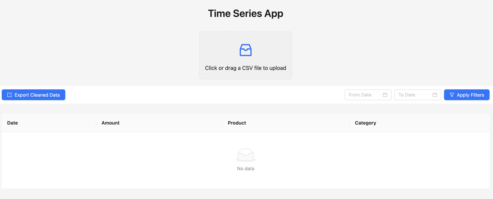

# Time-Series Application

This project is an Nx monorepo containing a frontend (React + Vite) and a backend (NestJS). It also includes a PostgreSQL database managed via Docker Compose.

## Prerequisites

- Node.JS (version >= v20.18.0)
- NPM (Node Package Manager)
- Docker (if you want to run the application with Docker)
- Postgres (if you want to run the application without Docker)

## Setup

### 1. Clone the repository:

```sh
git clone https://github.com/rjsaran/time-series.git
```

### 2. Navigate to the project directory:

```bash
cd time-series
```

### 3. Install Dependencies

Install dependencies using npm:

```sh
npm install
```

### 4. Configure Environment Variables

Both the frontend and backend require environment variables to be set. Copy the example .env files and modify them as needed.

For the backend:

```sh
cp packages/time-series-server/.env.example packages/time-series-server/.env
```

For the frontend:

```sh
cp packages/time-series-front/.env.example packages/time-series-front/.env
```

Modify the .env files with your configuration settings.

## Running the Project

### 1. Start PostgreSQL Database

Ensure Docker is installed and running. Then, start PostgreSQL:

```sh
npm run start:db
```

This runs PostgreSQL on port 5433 (update .env if needed).

**Stop the Database**

```sh
npm run stop:db
```

### 2. Seed the Database

Run the following command to seed the database: Ensure db is running.

```sh
npm run db:seed
```

### 3. Start Frontend and Backend Servers

To start both servers: Will also run docker postgresql database

```sh
npm run start:all
```

**Default Ports:**

Frontend: 4200

Backend: 4004

If needed, modify the .env files to change the ports.

## Additional Commands

You can also use the following Nx commands to build and serve the applications separately:

### Generate Sample CSV Data

To generate sample CSV data, run:

```sh
npm run generate:csv
```

### Start Backend Only

```sh
npx nx serve time-series-server
```

### Start Frontend Only

```sh
npx nx serve time-series-front
```

### Build Backend Only

```sh
npx nx build time-series-server
```

### Build Frontend Only

```sh
npx nx build time-series-front
```

## 📄 API Documentation

### Upload a CSV file

```sh
POST /api/v1/time-series/upload/csv
```

### Export cleaned data

```sh
GET /api/v1/time-series/export/csv
```

### List cleaned paginated data

```sh
GET /api/v1/time-series?limit=100&sort_order=ASC&page=1
```

### Get metrics

```sh
POST /api/v1/time-series/metrics
```

#### Request Body:

```json
{
  "filter": {
    "from": "2024-11-01T18:30:00.000Z",
    "to": "2025-12-31T18:30:00.000Z"
  },
  "group": {
    "by": { "interval": "daily" },
    "computes": [
      {
        "type": "sum",
        "path": "amount"
      }
    ]
  }
}
```

## 📸 Application States

### **1️⃣ Empty State**



---

### **2️⃣ Upload Button Click State**


---

### **3️⃣ After Upload - Table Display**


---

### **4️⃣ Charts View**


